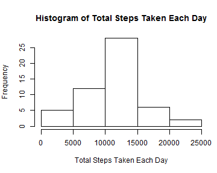
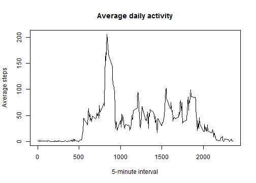
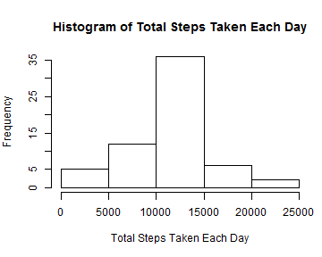
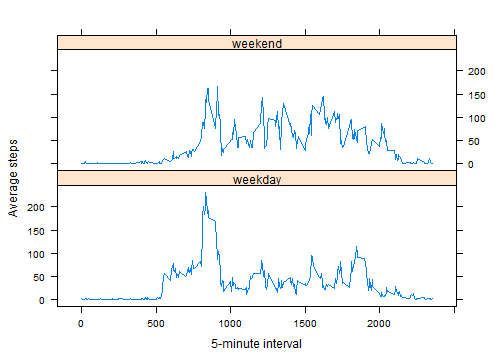

Reproducible Research: Peer Assessment 1
===

This report will be described in multiple parts. For detailed requirements please look at README.md.

### Loading and preprocessing the data
- After the repo was cloned to the working directory, there were 5 folders and files which are doc, instructions_fig, activity.zip, PA1_template.Rmd and README.md. Set the folder as working directory. 

```r
setwd("C:\\Users\\lenovo\\Documents\\RepData_PeerAssessment1")
```

- Unzip the compressed data

```r
fname <- unzip("C:\\Users\\lenovo\\Documents\\RepData_PeerAssessment1\\activity.zip", list = TRUE)$Name[1]
unzip("C:\\Users\\lenovo\\Documents\\RepData_PeerAssessment1\\activity.zip",
      files = fname, 
      exdir = "C:\\Users\\lenovo\\Documents\\RepData_PeerAssessment1",
      overwrite = TRUE)
```

- load the data(i.e. `read.csv()`)

```r
act <- read.csv("activity.csv", header=TRUE)
```

- Process/transform the data(if necessary) into a format suitable for your analysis

```r
act$date <- as.Date(act$date)
```

### What is mean total number of steps taken per day?
- ignore the missing values in the dataset

```r
clean <- na.omit(act)
```

- make a histogram of the total number of steps taken each day

```r
steps_total <- sapply(split(clean, clean$date), function(x) sum(x$steps))
par(mar=c(5,4,4,1))
hist(steps_total, 
     main ="Histogram of Total Steps Taken Each Day",
     xlab ="Total Steps Taken Each Day" )
```

 

- Calculate and report the mean and median total number of steps taken per day

```r
paste("Mean of total steps taken per day is:", mean(steps_total))
```

```
## [1] "Mean of total steps taken per day is: 10766.1886792453"
```

```r
paste("Median of total steps taken per day is:", median(steps_total))
```

```
## [1] "Median of total steps taken per day is: 10765"
```

### What is the average daily activity pattern?
- Make a time series plot (i.e. type = "l") of the 5-minute interval (x-axis) and the average number of steps taken, averaged across all days (y-axis).

```r
library(plyr)
steps_ave <- ddply(clean, .(interval), summarise, steps = mean(steps))
plot(steps_ave$interval, steps_ave$steps, type="l", xlab="5-minute interval",  
     ylab="Average steps",main="Average daily activity")
```

 

- Which 5-minute interval, on average across all the days in the dataset, contains the maximum number of steps?

```r
max_data <- steps_ave[steps_ave$steps == max(steps_ave$steps),]
```

### Imputing missing values
- Calculate and report the total number of missing values in the dataset (i.e. the total number of rows with `NAs`).

```r
my_na <- is.na(act)
paste("The total number of missing values is:", sum(my_na))
```

```
## [1] "The total number of missing values is: 2304"
```

- Devise a strategy for filling in all of the missing values in the dataset. The strategy does not need to be sophisticated. For example, you could use the mean/median for that day, or the mean for that 5-minute interval, etc.

    There are some days with all NAs, so replace `NA` with the mean for that 5-minute interval.

- Create a new dataset that is equal to the original dataset but with the missing data filled in.

```r
new_act <- arrange(act, interval)
Na_clean <-stack(lapply(split(new_act$steps, new_act$interval), function(y) {
                y[is.na(y)] <- mean(y, na.rm = TRUE)
                return(y)
    }))
new_act$steps<-Na_clean$values
```

- Make a histogram of the total number of steps taken each day 

```r
new_steps_total <- sapply(split(new_act, new_act$date), function(x) sum(x$steps))
par(mar=c(5,4,4,1))
hist(new_steps_total, 
     main ="Histogram of Total Steps Taken Each Day",
     xlab ="Total Steps Taken Each Day" )
```

 

- Calculate and report the mean and median total number of steps taken per day. 

```r
paste("Mean of total steps taken per day is:", mean(new_steps_total))
```

```
## [1] "Mean of total steps taken per day is: 10766.1886792453"
```

```r
paste("Median of total steps taken per day is:", median(new_steps_total))
```

```
## [1] "Median of total steps taken per day is: 10766.1886792453"
```

- Do these values differ from the estimates from the first part of the assignment? What is the impact of imputing missing data on the estimates of the total daily number of steps?

    Mean value didn't change as imputation used the average on 5-mi interval.
    Median value is a little bit bigger than the first part, because the frequency of the total steps taken each day slightly increased by imputation.

### Are there differences in activity patterns between weekdays and weekends?
- Create a new factor variable in the dataset with two levels ¨C ¡°weekday¡± and ¡°weekend¡± indicating whether a given date is a weekday or weekend day

```r
Sys.setlocale("LC_ALL", "English")
```

```
## [1] "LC_COLLATE=English_United States.1252;LC_CTYPE=English_United States.1252;LC_MONETARY=English_United States.1252;LC_NUMERIC=C;LC_TIME=English_United States.1252"
```

```r
new_act$week <- weekdays(new_act$date)
new_act$week<-gsub(pattern="(Monday|Tuesday|Wednesday|Thursday|Friday)",
               replacement="weekday", new_act$week)
new_act$week<-gsub(pattern="(Saturday|Sunday)",
               replacement="weekend", new_act$week)
head(new_act, n=7)
```

```
##    steps       date interval    week
## 1  1.717 2012-10-01        0 weekday
## 2  0.000 2012-10-02        0 weekday
## 3  0.000 2012-10-03        0 weekday
## 4 47.000 2012-10-04        0 weekday
## 5  0.000 2012-10-05        0 weekday
## 6  0.000 2012-10-06        0 weekend
## 7  0.000 2012-10-07        0 weekend
```

- Make a panel plot containing a time series plot (i.e. `type = "l"`) of the 5-minute interval (x-axis) and the average number of steps taken, averaged across all weekday days or weekend days (y-axis). 

```r
library(lattice)
steps_avg <- ddply(new_act, .(interval, week), summarise, steps = mean(steps))
steps_avg <- arrange(steps_avg, week)
xyplot(steps ~ interval|week, 
       type="l", 
       xlab="5-minute interval", 
       ylab="Average steps",
       layout = c(1, 2),
       data = steps_avg)
```

 
